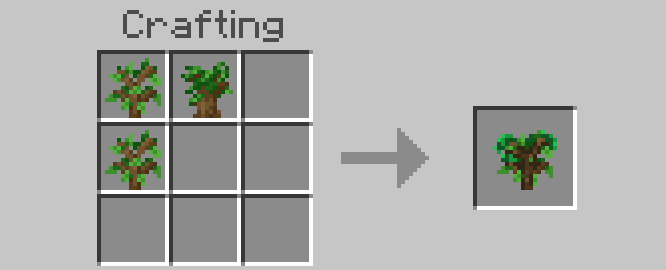
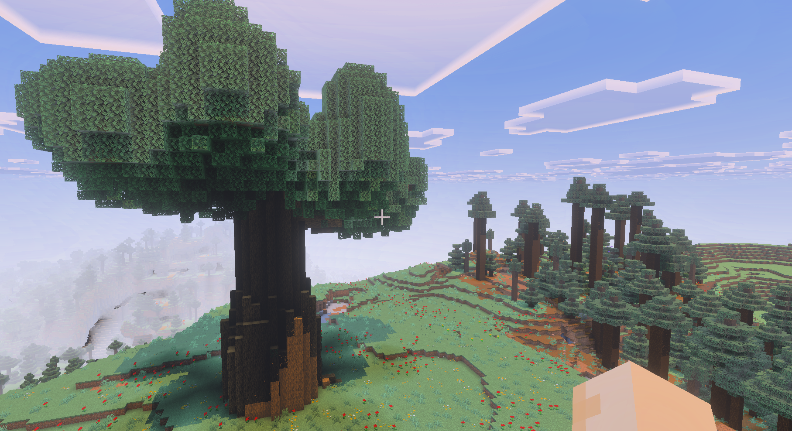

# CanopyCraft

**CanopyCraft** is a Minecraft Bedrock add-on that lets players grow massive, treehouse-ready megatrees using crafted **Fused Saplings** and **Grafting Kits**. Plant a custom sapling, watch your tree rise into the clouds, and carve out a home inside its hollow trunk or canopy.

> **Status:** In active development — Minecraft Preview with Beta APIs + GameTest required.

---

## Features

### MVP
- **Fused Sapling**: Crafted from multiple vanilla saplings.
  
- **Megatree Generator**: Large trunk & dense canopy


- **GameTest Integration**: Ensures correct size, footprint, and no damage to protected blocks.

### Future
- **Grafting Kit**: Grow new branches from graft points.
- **Tree Variants**: Jungle, Sakura, Redwood, and more.

---

## Development Setup

1. Install:
   - [Minecraft Preview](https://www.minecraft.net/en-us/about-minecraft-preview) with Beta APIs + GameTest enabled
   - [Node.js LTS](https://nodejs.org/)
   - [Visual Studio Code](https://code.visualstudio.com/)
   - [Blockception Minecraft Bedrock Development Extension](https://marketplace.visualstudio.com/items?itemName=BlockceptionLtd.blockceptionvscodeminecraftbedrockdevelopmentextension)
2. Clone this repo:
   ```bash
   git clone https://github.com/pete-mc/CanopyCraft.git
   cd CanopyCraft
